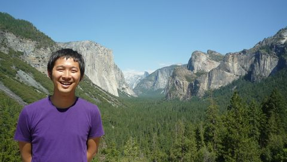

**名前**: 井上 芳幸 / Yoshiyuki Inoue\
**Email**: yinoue_at_shibaura-it.ac.jp (at を @ に変換してください)\
**研究分野**: 高エネルギー宇宙物理学、ブラックホール、活動銀河核、相対論的ジェット、宇宙背景放射\
**参加ミッション**: CTA (2010–), Fermi (2012–), NuSTAR (2012–2014), Hitomi (2012–2017), MAGIC (2019–2024), GRAMS (2019–)

**リンク**: [論文リスト](../publication/) / [データ公開](../downloads/) / [講演リスト](talks/) / [講義](teaching/) / [researchmap](https://researchmap.jp/yoshiyuki_inoue) / [ORCID](https://orcid.org/0000-0002-7272-1136) / [SciX](https://scixplorer.org/public-libraries/r0HdPWXHQKOV8kUwuZDq5Q) / [GitHub](https://github.com/yoshiyukiinoue)

## 学位

- 博士 (理学)、[京都大学](https://www.kyoto-u.ac.jp/)、2012年3月
- 修士 (理学)、京都大学、2009年3月
- 学士 (理学)、京都大学、2007年3月

## 職歴

- 芝浦工業大学システム理工学部 教授 (2026/04–)
- 客員科学研究員、Kavli IPMU (2018/07–)
- 大阪大学大学院理学研究科 准教授 (2020/09–2026/03)
- 客員研究員、理化学研究所数理創造プログラム (2025/04–2026/03)
- 客員主管研究員、理化学研究所数理創造プログラム (2020/09–2025/03)
- 理化学研究所数理創造プログラム 上級研究員 (2017/11–2020/09)
- JAXA国際トップヤングフェロー、宇宙航空研究開発機構/宇宙科学研究所 (2014/02–2017/10)
- 日本学術振興会海外特別研究員、KIPAC/SLAC国立加速器研究所/スタンフォード大学 (2012/04–2014/01)
- 日本学術振興会特別研究員 (DC1)、京都大学 (2009/04–2012/03)

## 受賞

- [2017年度 日本天文学会研究奨励賞](https://www.asj.or.jp/asj/prize/Shorei.html)

## 主な研究費

- 科研費 学術変革領域研究(A) 公募研究 (代表)、「理論と観測で解き明かすブラックホール天体の磁場」、FY2026–2027 — [26H00604](https://kaken.nii.ac.jp/ja/grant/KAKENHI-PUBLICLY-26H00604/)
- 科研費 挑戦的研究 (萌芽) (代表)、「理論とミリ波・X線観測を用いたブラックホール近傍磁場の解明」、FY2026–
- [JST 創発的研究支援事業](https://www.jst.go.jp/souhatsu/) (代表)、「事象の地平面近傍の磁場から紐解くブラックホール物理」、FY2026– — [課題ページ](https://research-er.jp/projects/view/1338875)
- NASA APRA Proposal (Co-I)、"A prototype flight for the GRAMS project"、FY2023–2026
- 科研費 挑戦的研究 (開拓) (分担)、"Elucidating the origin of heavy elements by a space-based gamma-ray detector using liquid argon"、FY2022–2027 — [22K18277](https://kaken.nii.ac.jp/ja/grant/KAKENHI-PROJECT-22K18277/)
- ALMA 共同科学研究事業 (代表)、「ALMAで解き明かす超巨大ブラックホールコロナの磁気活動」、FY2021–2023 — [事業ページ](https://researchers.alma-telescope.jp/j/support_programs/almagrant/list.html)
- 科研費 若手研究 (代表)、「電波・X線観測による巨大ブラックホール近傍の磁場測定」、FY2019–2023 — [19K14772](https://kaken.nii.ac.jp/ja/grant/KAKENHI-PROJECT-19K14772/)
- 科研費 新学術領域研究 (計画研究) (分担)、"Toward new frontiers: Encounter and synergy of state-of-the-art astronomical detectors and exotic quantum beams"、FY2018–2022 — [18H05458](https://kaken.nii.ac.jp/ja/grant/KAKENHI-PLANNED-18H05458/)
- 卓越研究員事業 (文部科学省 LEADER)、FY2017–2021
- 科研費 挑戦的萌芽研究 (代表)、"Probing the origin of the cosmic infrared background radiation using gamma-ray objects"、FY2016–2018 — [16K13813](https://kaken.nii.ac.jp/ja/grant/KAKENHI-PROJECT-16K13813/)
- Daiwa Foundation Grants for UK-Japan Collaboration (Co-I)、"Prospect for Future CTA Survey"、FY2016–2017
- JAXA 国際トップヤングフェローシップ (代表)、"Deciphering the Nature of Supermassive Black Holes Linking Theory and Observations"、2014/02–2019/01
- NASA Fermi Grant GI Cycle-6 (Co-I)、"Joint Analysis of Fermi/LAT and NuSTAR Observations of Blazars"、FY2013–2014
- 早川幸男基金、FY2013
- 日本学術振興会 海外特別研究員、「宇宙X線ガンマ線背景放射と活動銀河核の宇宙論的進化」、FY2012–2013
- 日本学術振興会 特別研究員 (DC1)、「GLAST時代の宇宙X線ガンマ線背景放射と活動銀河中心核」、FY2009–2011

## 委員歴

- 日本天文学会 ハラスメント防止ガイドライン策定タスクフォース委員 (2026/06–)
- 日本天文学会 代議員 (2026/06–)
- 東京大学宇宙線研究所 共同利用研究運営委員会委員 (2024/04–2026/03)
- 宇宙線研究者会議 (CRC) 実行委員会委員 (2024/04–2025/03)
- 宇宙線研究者会議 (CRC) 実行委員会委員 (2022/04–2023/03)
- 理論天文学宇宙物理学懇談会 運営委員 (2020/12–2022/11)

## SOC/LOC

| 研究会 | 場所 | 日程 |
| --- | --- | --- |
| [Eleventh Fermi Symposium](https://fermi.gsfc.nasa.gov/science/mtgs/symposia/eleventh/) (International SOC) | Maryland, USA | 2024/9/9–9/13 |
| [Beyond Obscuration (EAS Meeting Special Session)](https://eas.unige.ch/EAS2024/session.jsp?id=SS14) (SOC) | Padova, Italy | 2024/7/1 |
| [MeVガンマ線天文学：2020年代後半の展望 (天文学会企画セッション)](https://www.asj.or.jp/nenkai/archive/2024a/session-Z3.html) (SOC) | 東京 | 2024/3/11 |
| [ICRC2023](https://www.icrc2023.org/) (LOC / GA Session Convener) | 大阪 | 2023/7/26–8/3 |
| [第35回理論懇シンポジウム](https://sites.google.com/view/rironkon2022/) (SOC) | 福島 | 2022/12/21–12/23 |
| [第34回理論懇シンポジウム](https://sites.google.com/view/rironkon2021/) (SOC) | zoom | 2021/12/22–12/24 |
| [高エネルギー宇宙物理学研究会2021](https://sites.google.com/view/highenergyastrophys2021/) (SOC) | zoom | 2021/11/24–11/26 |
| [第2回MeVガンマ線天文学研究会](http://www-cr.scphys.kyoto-u.ac.jp/conference/mev-astro2/program.html) (SOC) | 東京 | 2019/9/26–9/27 |
| [高エネルギー宇宙ニュートリノから展開するマルチメッセンジャー天文学 (天文学会企画セッション)](https://www.asj.or.jp/nenkai/archive/2018b/session-Z2.html) (SOC) | 兵庫 | 2018/9/19–9/20 |
| [PACIFIC 2018](https://conferences.pa.ucla.edu/pacific-2018/) (LOC/co-Chair) | キロロ・北海道 | 2018/2/12–2/19 |
| [TeVPA2017](https://indico.cern.ch/event/615891/) (Gamma rays Session Convener) | Ohio, USA | 2017/8/7–8/11 |
| Ultra-Luminous X-ray Source 研究会 (SOC/LOC) | 相模原 | 2017/3/6–3/7 |
| [第1回MeVガンマ線天文学研究会](http://www-cr.scphys.kyoto-u.ac.jp/conference/mev-astro/program.html) (SOC) | 京都 | 2017/2/27–2/28 |
| 超巨大ブラックホール降着円盤スペクトルの解釈を巡って (SOC/LOC) | 相模原 | 2015/8/11–8/12 |
| 宇宙近赤外背景放射の観測と理論 (SOC/LOC) | 相模原 | 2014/10/6–10/8 |
